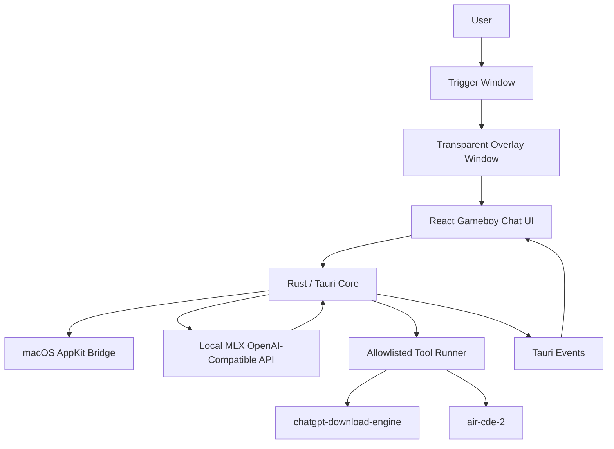

# AirAssistant Architecture

AirAssistant is a dockless macOS local-AI command overlay. It uses React and TypeScript for the retro chat UI, Rust/Tauri for native windows and safe local process orchestration, and a locally hosted OpenAI-compatible MLX server for assistant responses.

## Native Shell

- `overlay` window: compact top-center transparent window, hidden until opened, focusable only while the chat is active.
- `trigger` window: small bottom-right transparent window that remains clickable even when the overlay is hidden.
- macOS behavior comes from the Airmark AppKit bridge: all-spaces visibility, floating level, dockless accessory policy, and cursor-event control.
- Tray menu provides Open, Hide, LLM endpoint status, and Quit.

## Assistant Flow

1. React sends chat turns to Rust through `send_chat_turn`.
2. Rust injects the AirAssistant system prompt and calls `AIRASSISTANT_LLM_URL`, defaulting to `http://localhost:8080/v1/chat/completions`.
3. Rust parses the OpenAI-compatible response into `{ message, choices, proposedTool }`.
4. React renders the assistant message, two choices, and a persistent free-text input.
5. If a supported workflow is proposed, React shows a confirmation sheet before any command runs.

## Tool Safety

The LLM never provides shell text to execute. Rust accepts only these tool IDs:

- `chatgpt_export_incremental`: runs `/Users/macbookpro/Developer/chatgpt-download-engine/scripts/download-incremental.sh`.
- `chatgpt_doctor`: runs `python3 -m chatgpt_download_engine doctor` in `/Users/macbookpro/Developer/chatgpt-download-engine`.
- `air_cde_backup_incremental`: runs `node bin/cli.js --incremental --zip --output /Users/macbookpro/Documents/antigravity/lively-tesla/exports/air-cde` in `/Users/macbookpro/Documents/antigravity/fervent-galileo/air-cde-2`.

Rust validates fixed command specs, stores pending proposals by ID, streams stdout/stderr through `tool_log`, emits completion through `tool_done`, and supports cancellation by run ID.

## Environment

- `AIRASSISTANT_LLM_URL`: optional OpenAI-compatible chat completions URL.
- `AIRASSISTANT_LLM_MODEL`: optional model name, default `mlx`.

## Validation

- `npm run build`
- `cd src-tauri && cargo check`
- `npm run tauri build` for release packaging.
