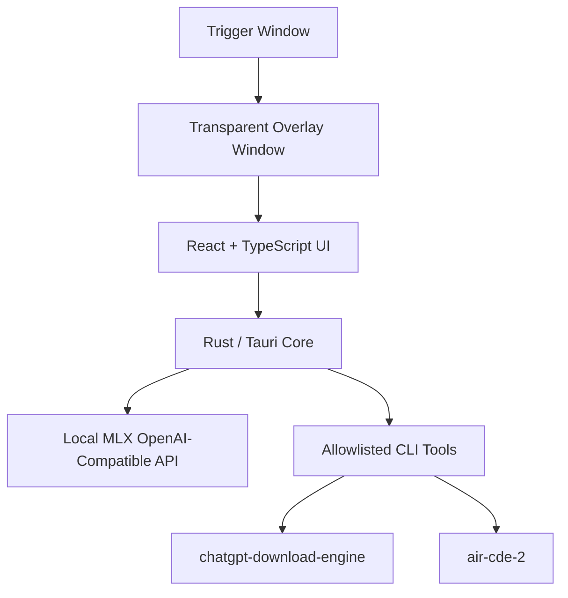

# AirAssistant

AirAssistant is a macOS 13+ dockless overlay prototype for local AI-assisted export and backup workflows. It combines a transparent Tauri shell, a React/TypeScript retro dialogue UI, a Rust command core, and a locally hosted OpenAI-compatible MLX endpoint.

## What It Does

- Shows a small bottom-right trigger button.
- Opens a semi-transparent top-middle chat overlay while leaving the rest of macOS usable.
- Talks to a local MLX server through `AIRASSISTANT_LLM_URL` or `http://localhost:8080/v1/chat/completions`.
- Renders assistant choices in a Gameboy/Nintendo-style dialogue flow.
- Requires user confirmation before running any local export or backup command.
- Streams allowlisted CLI output back into the overlay.

## Architecture



## Allowlisted Tools

- `chatgpt_export_incremental`: runs the local ChatGPT Download Engine incremental export script.
- `chatgpt_doctor`: checks ChatGPT Download Engine configuration without exporting.
- `air_cde_backup_incremental`: backs up Codex, Claude Code, and Antigravity knowledge using air-cde-2.

The LLM never sends raw shell commands for execution.

## Environment

```bash
export AIRASSISTANT_LLM_URL="http://localhost:8080/v1/chat/completions"
export AIRASSISTANT_LLM_MODEL="mlx"
```

Both variables are optional. The values above are the defaults.

## Develop

```bash
npm install
npm run tauri dev
```

## Verify

```bash
npm run build
cd src-tauri && cargo check
```

## Build

```bash
npm run tauri build
```

Release artifacts are written under `src-tauri/target/release/bundle/`.
